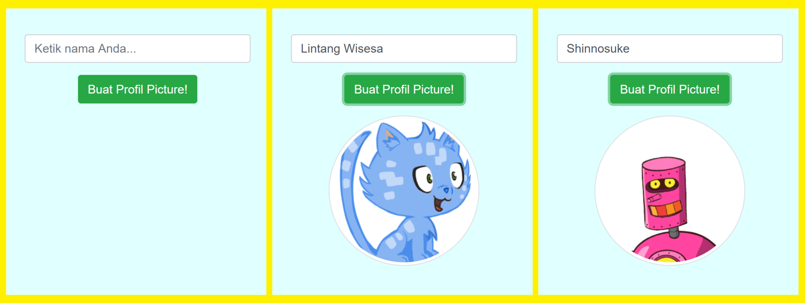
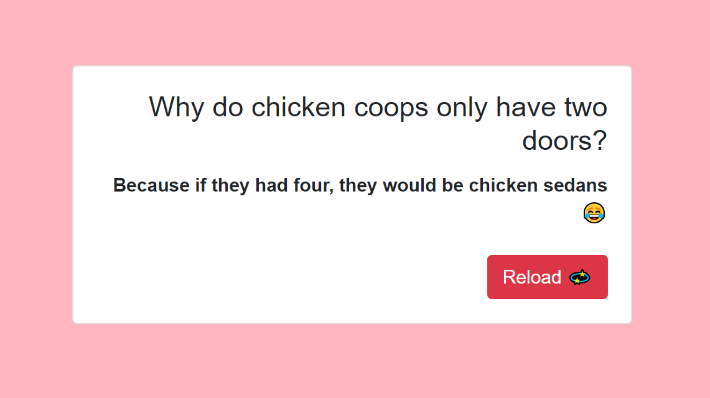

# Soal Ujian Purwadhika Front-End Web JC-07


**Materi Front-End Web Dev dapat diakses di [klik sini!](https://github.com/LintangWisesa/Purwadhika-JC06-02_FrontEnd)**
#

Panduan selengkapnya klik video berikut atau [klik di sini!](https://www.youtube.com/watch?v=37NdfNn8a8A)

[](https://www.youtube.com/watch?v=37NdfNn8a8A)

#
### **Soal 1 - Profile Picture Generator**

Buatlah sebuah project React yang dapat men-generate gambar avatar, dengan memanfaatkan layanan *__Robohash__* [(https://robohash.org/)](https://robohash.org/). Robohash merupakan layanan web untuk menampilkan gambar acak (robot, monster, alien atau kucing) berdasarkan input teks.

Alur kerjanya sederhana: user dapat memasukkan random teks ke dalam textbox input, kemudian gambar avatar akan muncul usai user menekan tombol.



>_**Catatan:**_ 1. *Deploy project ke Firebase Hosting.* 2. *Commit/upload project ini ke akun Github Anda dengan nama repo: __Profile_Picture_Generator__*. 3. *Salin file __App.js__ aplikasi ini ke dalam format .txt, sertakan pula link url ke repo Github project & link url hasil deploy. Kemudian kirimkan via email ke lintang@purwadhika.com dengan subject email: __Front-Soal1-namaAnda__.*

#
### **Soal 2 - Dad Jokes**

Buatlah sebuah project React yang menampilkan kumpulan lelucon dari __*Joke API*__ [(https://github.com/15Dkatz/official_joke_api)](https://github.com/15Dkatz/official_joke_api). Tampilkan dalam bentuk **Card Bootstrap**, lengkap dengan tombol __Reload__ untuk merefresh page. 

```bash
GET https://08ad1pao69.execute-api.us-east-1.amazonaws.com/dev/random_joke
```



>_**Catatan:**_ *Commit/upload project ini ke akun Github Anda dengan nama repo: **Dad_Jokes**. Salin file App.js aplikasi ini ke dalam format .txt, sertakan pula link url ke repo Github project ini. Kemudian kirimkan via email ke lintang@purwadhika.com dengan subject email: __Front-Soal2-namaAnda__.*

#
### **Soal 3 - Aplikasi Info Bitcoin**

Buatlah sebuah aplikasi React yang memanfaatkan info seputar Bitcoin dari Blockchain Exchange Rates API ([https://blockchain.info/api/exchange_rates_api](https://blockchain.info/api/exchange_rates_api)), dengan persyaratan sebagai berikut:

- **Gunakan navigasi React-Router-DOM**
  - Aplikasi terdiri atas **_3 halaman utama_**: halaman info harga Bitcoin, halaman konversi Rupiah ke Bitcoin dan halaman konversi Bitcoin ke Rupiah. Gunakan Route untuk membuat path bagi setiap halaman.

- **Gunakan Blockchain API**
  - Halaman pertama (info harga Bitcoin) menyajikan harga jual & harga beli Bitcoin terhadap 5 mata uang asing: **_Dollar Australia (AUD), Euro Eropa (EUR), Poundsterling Inggris (GBP), Yen Jepang (JPY)_** dan **_Dollar Amerika (USD)_**. Gunakan Exchange Rates API yang disediakan [Blockchain.info](https://blockchain.info/api/exchange_rates_api). Untuk mendapatkan semua data harga Bitcoin terhadap beberapa mata uang asing, gunakan:
    ```bash
    GET
    https://blockchain.info/ticker
    ```

  - Halaman kedua (konversi Rupiah ke Bitcoin) menyajikan fitur bagi user untuk mengkonversi Rupiah menjadi Bitcoin, dengan catatan 1 USD setara dengan Rp 14.000,-. Gunakan Bitcoin Conversion API yang disediakan [Blockchain.info](https://blockchain.info/api/exchange_rates_api). Sebagai contoh, untuk mengkonversi 500 USD menjadi harga Bitcoin, gunakan: 
    ```bash
    GET   
    https://blockchain.info/tobtc?currency=USD&value=500
    ```
  
  - Halaman ketiga (konversi Bitcoin ke Rupiah) menyajikan fitur bagi user untuk mengkonversi Bitcoin menjadi Rupiah, dengan catatan 1 USD setara dengan Rp 14.000,-. Gunakan Bitcoin Conversion API yang disediakan [Blockchain.info](https://blockchain.info/api/exchange_rates_api), yang sudah Anda pakai sebelumnya. 
  
    > _**Catatan:**_
    Mata uang Indonesia (IDR/Rupiah) tidak termasuk dalam data yang disediakan oleh API [Blockchain.info](https://blockchain.info/api/exchange_rates_api). Jadi, silakan modifikasi data yang Anda dapat dari API tersebut dengan algoritma yang sesuai.


>_**Catatan:**_ *Commit/upload project ini ke akun Github Anda dengan nama repo: **React_Bitcoin**. Salin file App.js aplikasi ini ke dalam format .txt, sertakan pula link url ke repo Github project ini. Kemudian kirimkan via email ke lintang@purwadhika.com dengan subject email: __Front-Soal3-namaAnda__.*

#

*__#HappyCoding__*

#### Lintang Wisesa :love_letter: _lintangwisesa@ymail.com_

[Facebook](https://www.facebook.com/lintangbagus) | 
[Twitter](https://twitter.com/Lintang_Wisesa) |
[Google+](https://plus.google.com/u/0/+LintangWisesa1) |
[Youtube](https://www.youtube.com/user/lintangbagus) |
:octocat: [GitHub](https://github.com/LintangWisesa) |
[Hackster](https://www.hackster.io/lintangwisesa)
